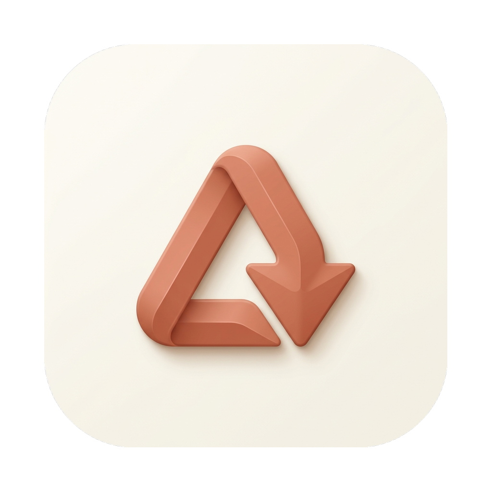

  

<h1 align="center">GDrive Downloader</h1>

  <strong>Giải pháp tải dữ liệu từ Google Drive nhanh nhất và ổn định nhất.</strong> 
  Tốc độ vượt trội, độ tin cậy tuyệt đối và giao diện hiện đại.

  <a href="#tinh-nang">Tính năng</a> •
  <a href="#cai-dat">Cài đặt</a> •
  <a href="#huong-dan">Hướng dẫn nhanh</a>

---

## Tại sao chọn GDrive Downloader?

Google Drive rất tuyệt vời, nhưng việc tải xuống các file hoặc thư mục lớn thường gặp lỗi "liên kết hết hạn" hoặc "phiên làm việc bị ngắt". **GDrive Downloader** giải quyết triệt để vấn đề này bằng cách tích hợp trực tiếp với trình duyệt của bạn, đảm bảo quá trình tải không bao giờ bị gián đoạn, ngay cả khi cookie hết hạn.

### ✨ Tính năng nổi bật

- 🚀 **Tải xuống Turbo**: Công cụ đa luồng (multi-threading) giúp tối đa hóa băng thông internet của bạn.
- 🍪 **Xác thực thông minh**: Tự động nhận diện phiên đăng nhập từ **Chrome, Brave, Edge hoặc Firefox**.
- 🔄 **Tự động làm mới**: Phát hiện cookie hết hạn và tự động làm mới trong nền mà không làm gián đoạn quá trình tải.
- 📂 **Hỗ trợ Thư mục**: Tải toàn bộ thư mục Google Drive chỉ với một cú nhấp chuột, giữ nguyên cấu trúc cây thư mục.
- 💾 **Lưu phiên làm việc**: Ghi nhớ trình duyệt và profile bạn đã chọn. Mở app lên là dùng được ngay.
- 🎨 **Giao diện Cao cấp**: Thiết kế tối giản, hiện đại lấy cảm hứng từ những xu hướng mới nhất, hỗ trợ đầy đủ Chế độ tối (Dark Mode).
- 👥 **Quản lý nhiều tài khoản**: Lưu nhiều tài khoản Google (theo từng trình duyệt và profile) — khi một tài khoản gặp lỗi xác thực, hệ thống tự động thử tài khoản khác mà không cần bạn can thiệp.
- 📄 **Hỗ trợ mọi loại file**: Tải được cả **Video, PDF, Image, Zip, Google Docs, Sheets, Slides** (xuất file) và mọi định dạng file thông thường.
- 📋 **Lịch sử tải xuống**: Xem lại toàn bộ lịch sử, tìm kiếm theo tên file hoặc lọc theo ngày, xóa từng mục hoặc xóa toàn bộ.

---

<h2 id="cai-dat">📦 Cài đặt</h2>

### Cho macOS
1. Tải file `.dmg` hoặc `.app` mới nhất từ trang [Releases](https://github.com/thuytx03/gdrive-downloader/releases).
2. Kéo biểu tượng **GDrive Downloader** vào thư mục `Applications`.
3. Mở ứng dụng. Nếu gặp lỗi **"Damaged and can't be opened"**, hãy mở Terminal và chạy lệnh:
   `sudo xattr -rd com.apple.quarantine "/Applications/GDrive Downloader.app"`

### Cho Windows
1. Tải file cài đặt `.exe` mới nhất từ trang [Releases](https://github.com/thuytx03/gdrive-downloader/releases).
2. Chạy file cài đặt. Nếu hiện thông báo "Windows protected your PC", hãy nhấn **More info** -> **Run anyway**.
3. Khởi chạy ứng dụng từ Desktop hoặc Start Menu.

---

<h2 id="huong-dan">🚀 Hướng dẫn nhanh trong 3 bước</h2>

1. **Dán liên kết**: Sao chép URL file hoặc thư mục Google Drive và dán vào thanh tìm kiếm.
2. **Chọn trình duyệt**: Chọn trình duyệt mà bạn đã đăng nhập Google Drive.
3. **Bắt đầu tải**: Nhấn nút Tải xuống và tận hưởng tốc độ vượt trội.

---

## 🛠 Công nghệ sử dụng

Được xây dựng trên nền tảng công nghệ hiện đại và hiệu suất cao:
- **Lõi**: [Tauri v2](https://tauri.app/) (Rust)
- **Backend**: [FastAPI](https://fastapi.tiangolo.com/) (Python)
- **Frontend**: [React](https://react.dev/) + [Vite](https://vitejs.dev/)
- **Giao diện**: [Tailwind CSS](https://tailwindcss.com/) + [shadcn/ui](https://ui.shadcn.com/)
- **Cơ sở dữ liệu**: [SQLite](https://sqlite.org/) với SQLModel

---

## 📄 Bản quyền

Dự án này được cấp phép theo Giấy phép MIT - xem file [LICENSE](LICENSE) để biết thêm chi tiết.

  Phát triển với Trịnh Xuân Thủy

